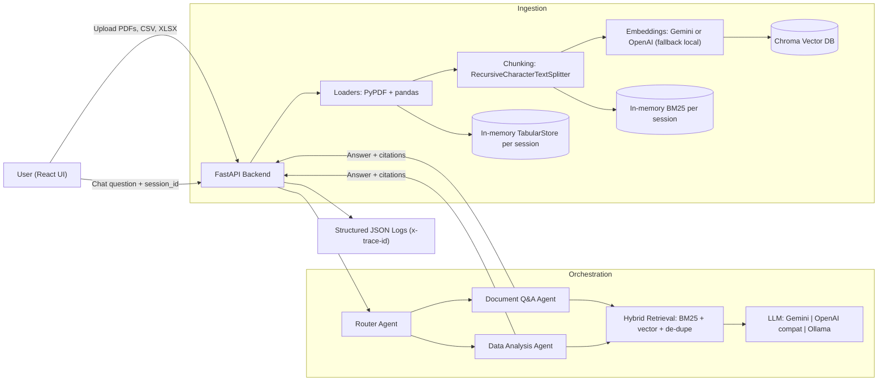

# Project Intelligence Assistant — Architecture

## System overview
This system ingests **messy project documents (PDF)** and **tabular data (CSV/Excel)**, then answers user questions via a **multi-agent RAG** backend (Python + LangChain) exposed through a **REST API**, with a **React** UI. It supports **follow-up questions** by preserving conversation state per `session_id`.

**Deployment shape (as submitted):** a *single Docker service* serves both the React UI (`/`) and the FastAPI API (`/api/*`). The app is deployed on a free-tier PaaS (Render). On free-tier without persistent disks, uploaded files and vector indexes are **ephemeral**; users re-upload after a restart/spin-down.

### High-level diagram

## Technology selection (and trade-offs)

### Backend framework: FastAPI
- **Chosen**: FastAPI for simple REST endpoints (`/api/upload`, `/api/chat`) and async support.
- **Alternatives**: Flask, Django.
- **Trade-offs**: FastAPI is lightweight and fast for a prototype; Django would help if we needed auth/admin quickly.

### Orchestration: LangChain
- **Chosen**: Required by assessment; used for LLM calls, document types, retrievers, and prompts.
- **Alternatives**: LlamaIndex, custom orchestration.
- **Trade-offs**: LangChain gives composable building blocks; you must be careful about version churn.

### Vector DB: Chroma (local persistence)
- **Chosen**: Chroma for local-first persistence and straightforward metadata filtering by `session_id`.
- **Alternatives**: FAISS (no metadata filtering), Qdrant (great for production), Pinecone (managed).
- **Trade-offs**: Chroma is ideal for a take-home demo; for production/multi-tenant, Qdrant or a managed service would be preferred. On Render Free without persistent disks, the Chroma data is ephemeral (acceptable for a demo; not for production).

### Embeddings: Gemini (preferred) with fallback
- **Chosen**: Gemini embeddings via `GoogleGenerativeAIEmbeddings` (default model: `gemini-embedding-001`) because it’s free-tier friendly and matches the chosen hosted LLM provider.
- **Alternatives**: OpenAI embeddings; local `sentence-transformers`.
- **Trade-offs**: Hosted embeddings simplify deployment (no Torch). Local embeddings reduce vendor dependency, but add heavier dependencies and may be slower on CPU-only deployments.

### LLM: Gemini (preferred) with alternatives
- **Chosen**: Gemini via `ChatGoogleGenerativeAI` (default model: `gemini-2.5-flash`) for low-latency/cost.
- **Alternatives**: OpenAI-compatible endpoints (`openai_compat`); local Ollama for on-prem/offline scenarios.
- **Trade-offs**: Gemini is simplest for cloud demo, but introduces external dependency and model availability/versioning considerations; Ollama reduces external calls but requires local GPU/CPU capacity and increases ops complexity.

## Data pipeline design

### Ingestion
- **PDF**: `PyPDFLoader` extracts per-page text with metadata (`filename`, `page`, `session_id`).
- **CSV/XLSX**: `pandas` loads tables; tables are converted to a readable markdown preview Document (for citation) and also stored as DataFrames for numeric aggregation.

### Chunking strategy
- **Splitter**: `RecursiveCharacterTextSplitter(chunk_size=900, chunk_overlap=150)`.
- **Why**: Project documents often tie numbers to surrounding narrative (assumptions, dates). A ~900 char chunk preserves enough context for “what changed and why” questions, while overlap reduces boundary losses.

### Indexing
- **Dense**: Chroma stores embedded chunks with `session_id` for retrieval filtering.
- **Sparse**: BM25 index is maintained per session in-memory for hybrid retrieval.

## Retrieval beyond naive similarity search
The system uses **hybrid retrieval**:
- **BM25** to catch exact-match terms (risk IDs like `R-07`, vendor names, acronyms).
- **Vector similarity** for semantic matching.
Results are combined in a version-stable way: top-\(k\) from BM25 + top-\(k\) from vector search are concatenated and **de-duplicated** (so the prototype is resilient to LangChain API changes around ensemble retrievers).

Optional: **Cross-encoder reranking** can be enabled (`ENABLE_RERANK=true`) to improve precision on long-context queries at extra latency.

## Agent orchestration

### Agents
- **Router Agent**: classifies a user query into `document_qa` vs `data_analysis`.
- **Document Q&A Agent**: retrieves document chunks and generates a grounded answer with citations.
- **Data Analysis Agent**: computes numeric aggregates when possible (budget/actual/forecast/variance), otherwise falls back to table-RAG.

### Routing
- Default is LLM-based JSON routing; it falls back to heuristics if the LLM is unavailable.

### Failures and fallbacks
- If ingestion fails for an unsupported file type, upload returns a 4xx/5xx and logs the error.
- If routing fails, heuristic routing triggers (ensures the request still completes).
- If data analysis cannot find usable numeric columns, the agent falls back to retrieval-only responses with citations.
- If the LLM is unavailable, the system returns a **degraded but honest** response: it lists the most relevant retrieved excerpts with citations, plus the underlying provider error message. This prevents silent failures during demos and supports interview debugging.

## Scalability, cost, and production readiness

### Rough cost-per-query (order of magnitude)
Varies by provider and prompt size. A practical way to estimate cost is:

\[
\text{cost/query} \approx \text{LLM}(\text{input tokens},\ \text{output tokens}) + \text{embeddings}(\text{chunks indexed}) 
\]

- **LLM tokens**: dominated by the number and size of retrieved chunks (context) + the user question + chat history.
- **Embedding tokens**: dominated by document chunk count; incurred primarily at upload time (indexing), not per query.
- **Ollama local**: ~$0 external API cost; compute-bound (latency + CPU/GPU).

### Top bottlenecks + mitigations
- **LLM latency**: cache retrieval results; reduce context size via reranking; use smaller model for routing.
- **Embedding/indexing time on upload**: batch embedding; background ingestion job queue (Celery/RQ); incremental updates.
- **In-memory session stores (BM25 + DataFrames)**: move to Redis/Postgres for sessions; persist BM25 or replace with production hybrid search in Qdrant/Elastic.

### Observability
- Structured JSON logs include `x-trace-id`, `session_id`, agent name, latency, and (best-effort) token usage.
- Next step: OpenTelemetry spans across router → retriever → generator.

### Security considerations (prototype → production)
- **Prompt injection**: “context-only” instruction, no arbitrary tool execution, and citations are derived from retrieved chunks (not user input).
- **API keys**: stored only in environment variables (never returned to users).
- **Data privacy**: session-scoped retrieval filter prevents cross-session leakage. For production: add authentication + per-tenant storage isolation and encryption-at-rest.
- **Uploads** (recommended next steps): MIME/type validation, file size limits, antivirus scanning, and content-type allowlists.

## Adapting to “on-prem, no external API calls”
- Set `LLM_PROVIDER=ollama` and run a local model.
- Use local embeddings (`backend/requirements-local.txt`) to remove external embedding calls.
- Keep Chroma for a single-node deployment, or replace with Qdrant local for operational maturity.

